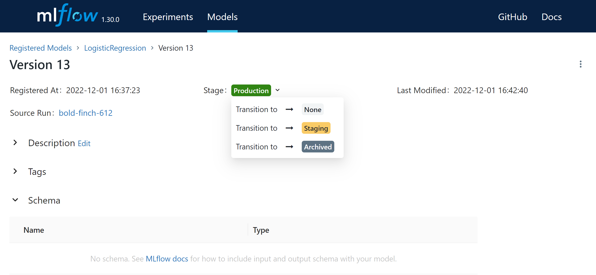

# MADE-2022 | MLOps | HW3
## Quick start
Make airflow variables:
```commandline
export LOCAL_DATA_DIR=$(pwd)/data
export LOCAL_MLRUNS_DIR=$(pwd)/mlruns
```
Build airflow docker container:
```commandline
docker-compose up --build
```
Airflow is now avaliable at http://localhost:8080, login = `airflow`, password = `airflow`.
Before triggering a prediction DAG, set the trained model to the `production` stage:



## Quick test
Install pytest:
```commandline
pip install pytest
```
Test:
```commandline
python -m pytest --disable-warnings tests/test_dag_structure.py
python -m pytest --disable-warnings tests/test_dag_loading.py
```
